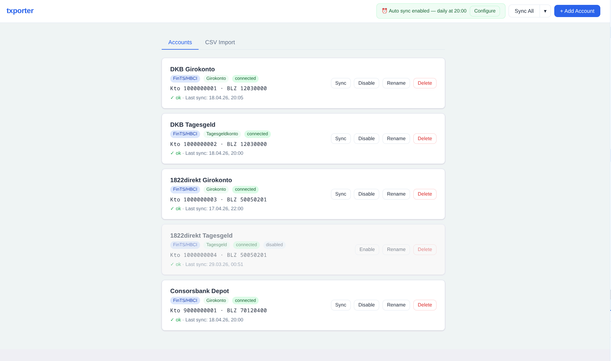
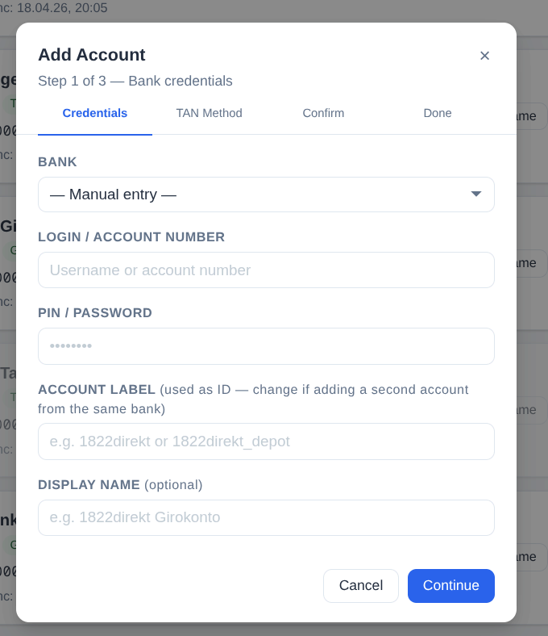
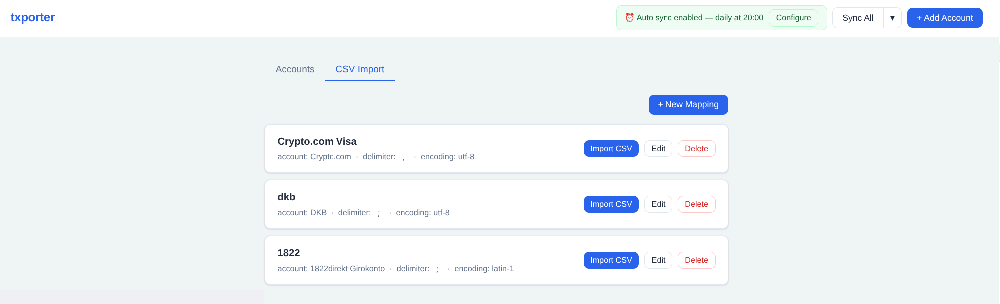
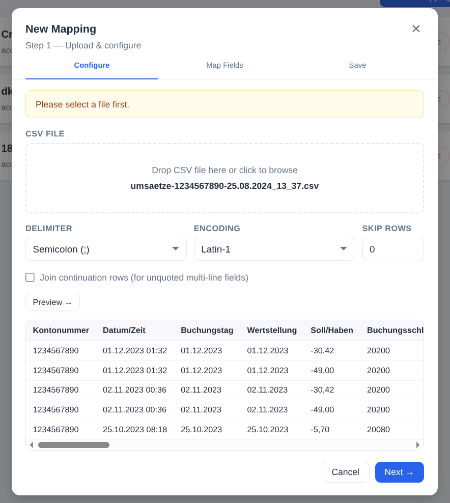
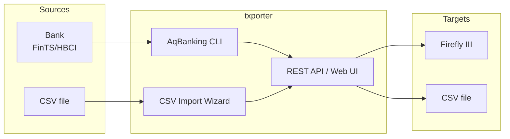

# txporter

[](https://sonarcloud.io/summary/new_code?id=develff_txporter)

A Dockerized REST service that fetches transactions from financial accounts and forwards them to Firefly III or CSV files.

> **Security notice:** txporter has no built-in authentication. It is designed exclusively for use on a trusted local network or private Docker network. **Never expose port 8090 to the internet.** Restrict access via firewall, reverse proxy with authentication, or VPN.

## Motivation

txporter was created because I wanted a single tool to sync all my financial accounts to Firefly III — German banks via FinTS/HBCI and CSV-based sources (e.g. Crypto.com) alike. Existing tools either didn't support FinTS/HBCI reliably (at least in my case), or covered only one source type and required juggling multiple importers. The goal was one self-hosted, Docker-based solution that handles everything.

## Features

- Fetch transactions from German banks via FinTS/HBCI (using AqBanking)
- Import transactions from CSV exports (e.g. Crypto.com)
- Forward transactions to Firefly III via REST API
- Export transactions as CSV
- On-demand sync via REST API or Web UI
- Scheduled automatic sync
- Multi-account support
- Bank account setup via REST API (no shell access needed)

## Supported Sources

| Source | Protocol | Status |
|--------|----------|--------|
| DKB | FinTS/HBCI | ✅ working |
| 1822direkt | FinTS/HBCI | ✅ working |
| Consorsbank | FinTS/HBCI | ✅ working |
| Other German banks | FinTS/HBCI | should work (untested) |
| CSV file import | — | ✅ working |

## Supported Targets

| Target | Status |
|--------|--------|
| Firefly III (REST API) | ✅ working |
| CSV file | ✅ working |

## Screenshots

<table>
  <tr>
    <td align="center" valign="top" width="50%">
      <strong>Account overview</strong><br><br>
      
    </td>
    <td align="center" valign="top" width="50%">
      <strong>Add account wizard</strong><br><br>
      
    </td>
  </tr>
  <tr>
    <td align="center" valign="top" width="50%">
      <strong>CSV import — mapping profiles</strong><br><br>
      
    </td>
    <td align="center" valign="top" width="50%">
      <strong>CSV import — field mapping wizard</strong><br><br>
      
    </td>
  </tr>
</table>

## Known Issues

- **1822direkt — manual date range**: Fetching transactions with a custom date range triggers a different TAN flow at 1822direkt that is not compatible with txporter. Use the default sync window instead.
- **CSV import — split fields**: If a CSV export spreads a value across multiple columns (e.g. a payment purpose split into `Vwz.0`–`Vwz.17`), txporter can only map one column per field. Manual pre-processing of the CSV is required in that case.

## Security

txporter has **no built-in authentication or authorization**. Every request to port 8090 is trusted unconditionally — anyone who can reach it can read your bank account data, trigger syncs, and modify configuration.

**Only run txporter on a trusted local network or private Docker network.** Recommended mitigations:

- Bind the port to `127.0.0.1` only (default) and access via SSH tunnel
- Place behind a reverse proxy (Nginx, Caddy) with HTTP Basic Auth or SSO
- Restrict access at the firewall / Docker network level

## Requirements

- Docker
- Docker Compose

## Quick Start

```bash
# Clone the repository
git clone https://github.com/develff/txporter.git
cd txporter

# Copy and edit config
cp config/banks.example.json config/banks.json
# Add your Firefly III URL and token to config/banks.json

# Start the service
docker compose up -d

# Open the Web UI
open http://localhost:8090
```

The Web UI guides you through bank account setup and lets you trigger syncs manually.

### Bank account setup (REST API)

Bank registration is done via the REST API — no shell access or manual file editing required.

```bash
# Register a bank account (profile-based)
curl -X POST http://localhost:8090/setup \
  -H "Content-Type: application/json" \
  -d '{"bank": "dkb", "login": "YOUR_LOGIN", "pin": "YOUR_PIN"}'

# Confirm the TAN in your banking app, then:
curl -X POST http://localhost:8090/setup/{setup_id}/confirm
```

See [docs/setup.md](docs/setup.md) for the full setup flow including photoTAN/chipTAN banks.

### Sync

```bash
# Sync a single account
curl -X POST http://localhost:8090/sync/dkb

# For FinTS accounts: confirm TAN in banking app, then:
curl -X POST http://localhost:8090/sync/dkb/confirm

# Sync all accounts
curl -X POST http://localhost:8090/sync
```

### CSV Import

Upload any CSV export (e.g. Crypto.com, N26 export) via the Web UI. A 3-step wizard lets you map CSV columns to Firefly III fields and save reusable profiles.

## Architecture



## Configuration

See [docs/configuration.md](docs/configuration.md) for details on `banks.json`, environment variables, and the full REST API reference.

## Built with

- [AqBanking](https://www.aquamaniac.de/rdm/projects/aqbanking) — FinTS/HBCI banking library (LGPL-2.1)
- [Flask](https://flask.palletsprojects.com/) — web framework (BSD)
- [requests](https://docs.python-requests.org/) — HTTP client (Apache-2.0)

## License

txporter is available under a dual license:

- **Open source use**: [GNU Affero General Public License v3.0](LICENSE)
  Free for personal and open source projects. Any modifications or
  hosted versions must be released under the same license.

- **Commercial use**: A separate commercial license is required.
  See [LICENSE.commercial](LICENSE.commercial) or contact the author.

Copyright (C) 2026 develff
